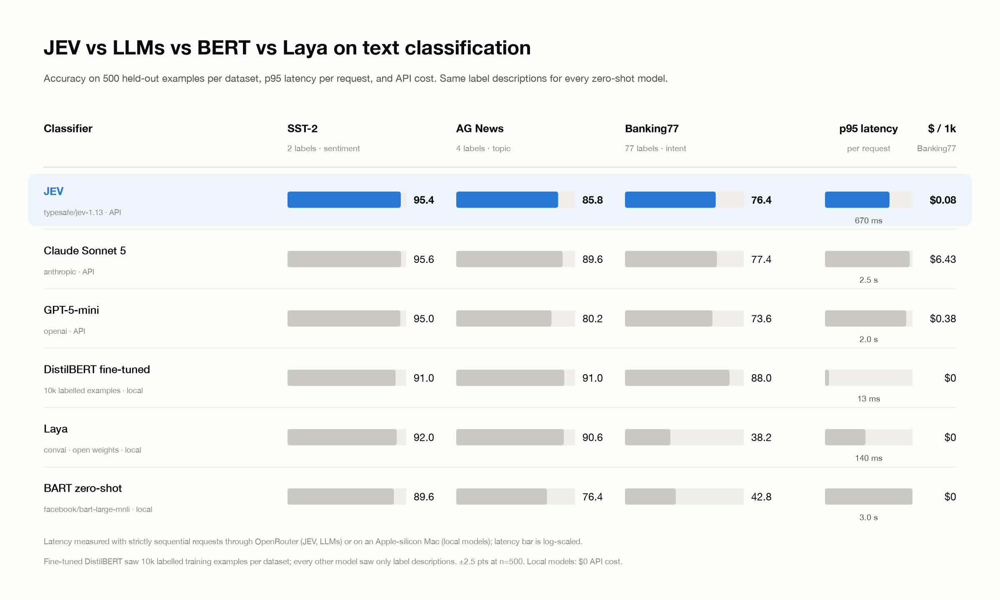

# jevbench

Is TypeSafe's **JEV** a better text classifier than LLMs, BERT, or the open-weights
alternatives? This is a small, reproducible benchmark that runs six classifiers over
three public datasets and reports accuracy, calibration, latency, throughput and cost
side by side.



Full tables with macro-F1, ECE, p50/p95 and throughput: [`docs/results/2026-09-22-n500-summary.md`](docs/results/2026-09-22-n500-summary.md).

## What is being compared

| Classifier | What it is | Runs |
|---|---|---|
| `jev` | TypeSafe `typesafe/jev-1.13`, a "System One" model. One `choice` question per example, returns per-label probabilities. | OpenRouter **Decisions API** (`/api/alpha/decisions`, not chat completions) |
| `laya` | Convai `convaiinnovations/laya`, open-weights (Apache 2.0) System One model, 421M params, same question format as JEV | local, MPS or CPU |
| `llm-cheap` | small fast LLM (default `openai/gpt-5-mini`), JSON-schema enum output | OpenRouter chat completions |
| `llm-frontier` | frontier LLM (default `anthropic/claude-sonnet-5`), same prompt | OpenRouter chat completions |
| `bert-ft` | `distilbert-base-uncased` fine-tuned per dataset on up to 10k train examples | local, MPS or CPU |
| `bert-zs` | `facebook/bart-large-mnli` zero-shot NLI | local, MPS or CPU |

| Dataset | HF repo | Labels | Eval split |
|---|---|---|---|
| `sst2` | `stanfordnlp/sst2` | 2, sentiment | validation |
| `agnews` | `fancyzhx/ag_news` | 4, topic | test |
| `banking77` | `legacy-datasets/banking77` | 77, intent | test |

A fixed, seeded sample of N examples (default 500) is drawn from each held-out split.
Every zero-shot model receives the **same label descriptions**, defined once in
`src/jevbench/datasets.py` and reused for JEV criteria, Laya criteria, the LLM prompt
and the NLI hypotheses. All datasets and local models are public; no HuggingFace token
is needed.

## Setup

Requires [uv](https://docs.astral.sh/uv/). Python 3.12 is pinned and fetched automatically.

```bash
git clone https://github.com/dhruvmehra/jevbench.git
cd jevbench
uv sync --extra dev
cp .env.example .env         # then put your OpenRouter key in .env
uv run pytest                # 31 offline tests, no network
```

Only one key is needed: `OPENROUTER_API_KEY` from https://openrouter.ai/keys. It covers
JEV and both LLMs. The local models need no key. `.env` is gitignored.

## Run

```bash
# 5-example sanity check against the APIs (costs well under a cent)
uv run jevbench run --smoke --classifiers jev llm-cheap --datasets sst2

# everything, 500 examples per dataset (~90 min, ~$9, mostly the frontier LLM)
uv run jevbench run

# subsets
uv run jevbench run --classifiers jev laya bert-ft --datasets banking77 --n 200
uv run jevbench run --classifiers laya                      # local only, no key needed

# re-render summary.md for an existing run
uv run jevbench report results/<run-id>
```

Flags: `--n`, `--seed`, `--datasets`, `--classifiers`, `--skip-throughput`,
`--no-cache` (force fresh requests for latency timing), `--smoke`, `--out`, `--config`.

Output lands in `results/<timestamp>/`: one JSON per classifier-dataset pair containing
every prediction and the raw provider response, plus `summary.md` with one table per
dataset.

The first `bert-ft` run fine-tunes DistilBERT per dataset (about 7 to 10 minutes each on
an Apple-silicon Mac) and saves the model under `models/`. Later runs reuse it. The first
`laya` and `bert-zs` runs download their weights (about 0.8 GB and 1.6 GB) into the
HuggingFace cache.

## What gets measured

- **Accuracy, macro-F1** over examples the classifier answered. **Err%** is the share it
  failed on (API error after 3 retries, unparseable or off-enum LLM output).
- **ECE** (expected calibration error, 10 bins) wherever per-class probabilities exist:
  JEV, Laya and both BERT variants. LLMs return no probabilities, so ECE is blank for them.
- **p50 / p95 latency** per example, requests strictly sequential (parallelism 1).
- **Throughput** on a second pass: concurrency 8 for APIs, batch size 32 for batchable
  local models, sequential for Laya.
- **$/1k** from the providers' own `usage.cost`. Local models are $0 per call; fine-tuning
  wall-clock is listed under the table.

API classifiers run concurrently with each other; local models run one at a time so they
do not contend for the GPU. Successful API responses are cached in `cache.sqlite`, so
re-running for accuracy is free. When a latency pass is served entirely from cache the
latency columns are blank; use `--no-cache` for fresh timings.

## Adding a dataset or a classifier

**Dataset:** add a `DatasetSpec` to `DATASETS` in `src/jevbench/datasets.py` with the HF
repo, the split to evaluate on, the text column, and a `label id -> description` map in
the dataset's integer-label order. That is all; every classifier picks it up.

**Classifier:** implement the `Classifier` protocol in `src/jevbench/classifiers/base.py`
(`name`, `model_id`, `prepare(dataset)`, `async predict_batch(texts, labels, parallelism)`
returning `Prediction` records) and register it in `build_classifiers` in
`src/jevbench/runner.py`. Set `supports_batch = False` if it can only take one input at a
time. See `classifiers/laya.py` for a 60-line example.

## Caveats when reading results

- Fine-tuned DistilBERT has seen thousands of labelled examples; JEV, Laya, the LLMs and
  the zero-shot NLI model see only label descriptions. Both comparisons are useful; they
  answer different questions.
- At n=500 the 95% confidence interval on accuracy is roughly ±2.5 points. Several
  rankings in the results table are ties.
- SST-2 and AG News are old, widely published datasets; the LLMs have very likely seen
  them in pretraining. AG News also has a noisy Business vs Sci/Tech boundary. Banking77
  is the cleanest of the three.
- `temperature` is not sent to LLMs because the gpt-5 family rejects it; the JSON-schema
  enum plus low reasoning effort is the determinism lever. Reasoning effort is configurable
  per model in `config.toml`, and the parameter is dropped automatically if a model rejects it.
- Latency for JEV and the LLMs is measured through OpenRouter and includes that hop.
  Local timings are for the machine that ran them, recorded in each result file.

## License

MIT
